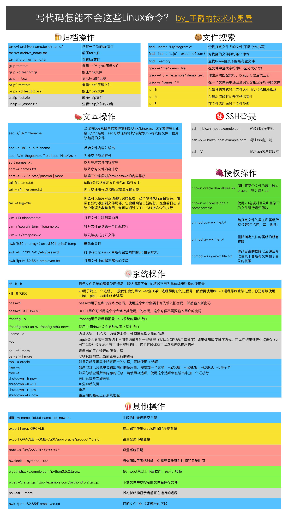

### graph



### OLD
https://github.com/pq1949/guide


### 统计PV  UV

```bash
cat vip.log.mgtv.com-access.log-20211111 | awk -F '~A' '{print $5}' | awk -F 'uuid=' '{print $2}' | awk -F '&' '{print $1}'  | wc -l


cat vip.log.mgtv.com-access.log-20211111 | awk -F '~A' '{print $5}' | awk -F 'uuid=' '{print $2}' | awk -F '&' '{print $1}'  | sort | uniq |wc -l
```

https://man.linuxde.net/
https://wangchujiang.com/linux-command/c/awk.html


###  Linux SysOps Handbook
https://abarrak.gitbook.io/linux-sysops-handbook
