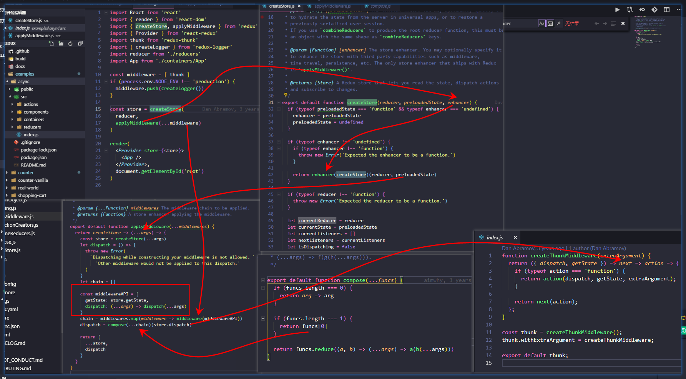
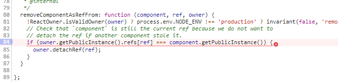
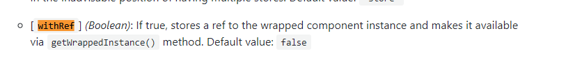

### [react-lifecycle-methods-diagram](https://github.com/wojtekmaj/react-lifecycle-methods-diagram)
  * http://projects.wojtekmaj.pl/react-lifecycle-methods-diagram/


### react 动画库
  * [react-motion](https://github.com/chenglou/react-motion) ⭐️⭐️⭐️⭐️⭐️
    * [react-motion-drawer](https://github.com/stoeffel/react-motion-drawer)
  * [react-spring](https://github.com/react-spring/react-spring)⭐️⭐️⭐️⭐️⭐️

### 数据流
  * [MobX](https://suprise.gitbooks.io/mobx-cn/content/fp.html)
  * [Mobx使用详解](https://www.jianshu.com/p/505d9d9fe36a)


### redux 源码
  * [Redux入坑进阶-源码解析](https://github.com/ecmadao/Coding-Guide/blob/master/Notes/React/Redux/Redux%E5%85%A5%E5%9D%91%E8%BF%9B%E9%98%B6-%E6%BA%90%E7%A0%81%E8%A7%A3%E6%9E%90.md)    [备份](../backup/redux)

    中间中的`next`参数是下一个中间件，最后一个中间件的`next`是`store.dispatch`

    `middlewares=[a,b,c,d,e]` => `applyMiddleware(...middlewares)` => `compose(...middlewares.map(middleware => middleware({getState,dispatch})))(store.dispatch)`
    => `compose(...chain)` => `a(b(c(d(e(store.dispatch)))))`

    

### Hooks, React Render props, HOC,  Mixins

 * [[译] 使用 Render props 吧！](https://juejin.im/post/5a3087746fb9a0450c4963a5)
 * [Render Props 官网](https://reactjs.org/docs/render-props.html)
 * [React v16.7 "Hooks" - What to Expect](https://zhuanlan.zhihu.com/p/47684983)


#### A Complete Guide to useEffect ⭐️⭐️⭐️

https://overreacted.io/a-complete-guide-to-useeffect/
https://overreacted.io/zh-hans/a-complete-guide-to-useeffect/


###  深入React fiber 链表和DFS
https://mp.weixin.qq.com/s/Tp05MoV1bQi7rgpYnz1Xhg


### React ref 的前世今生

使用ref时最好使用函数的形式进行负责，字符串的情况有时会出错，并且也影响性能

遇到一个使用string的ref错误，在这里报错, 改成了函数形式就可以了





https://juejin.im/post/5b59287af265da0f601317e3
https://stackoverflow.com/questions/37468913/why-ref-string-is-legacy
https://stackoverflow.com/questions/28519287/what-does-only-a-reactowner-can-have-refs-mean


### ant-design 动态更改From.Item校验规则


Validate 后 Form 会缓存结果，如果你直接动态改 rule 的话，加一个 force 来强制无视缓存就好了

https://codesandbox.io/s/oj9r74k329


https://github.com/ant-design/ant-design/issues/13689


### onClick onChange onKeyUp onKeyDown 事件

`onKeyDown` 获取的 `e.target.value` 总是上一次输入的结果

只有`onKeyDown` `onKeyUp`能获取到 `e.keyCode`

`onChange` 和 `onKeyUp` 都获取到实时输入的 e.target.value`

所以想同时处理 `e.target.value` 和  `e.keyCode` 应该使用 `onKeyUp`

https://codesandbox.io/embed/1j7vj4k27


### React中Redux与通过 connect后获取 ref

1. 可以在`connect`组件加上 `withRef` 参数
```js
@connect(state => ({
  language: state.language,
  smsStatistics: state.billing.smsStatistics,
  mobileStatistics: state.billing.mobileStatistics
}), actionCreators, null, { withRef: true })
```

文档看这里
https://react-redux.js.org/5.x/api/connect-advanced#arguments


获取的时候可以这样
```js
this.halfYear.getWrappedInstance()
```

https://segmentfault.com/a/1190000015172005


2. 可以在包装组件的 `componentDidMount` 方法中调用父组件的方法，把自己的引用主动上报到父组件

connect的组件中componentDidMount方法中
```js
componentDidMount () {
  this.props.saveRef(this)
}
```
父组件中定义好 `saveRef` 接收子组件的引用

```js
saveRef(node) {
  this.childNode = node
}
```

类似的 `rc-form` 中也可以通过类似的方法获取，不过`rc-form`中也有类似1的方式，建议使用官方提供的方法


### React 中有时候 componentWillReceiveProps 中的 nextProps 和 this.props 始终相等

出现这种情况一般是由于传给组件的props一致是同一个对象，使用的是相同的对象的引用地址，导致无法区分前后的props

修改方法就是传给组件的props组件记得要拷贝出一份新的出来即可，

在使用 ant的tabel组件的时候遇到了这个问题，渲染列表数据时想通过 props 来改变组件内部的值，但是 `componentWillReceiveProps`中的前后  `props`值都一样，无法区分

可以看这里，体验一下，https://codesandbox.io/embed/0prjz46r3v

当然一般子组件的props都是绑定在state上，通过`setstate`改变state时，会重新拿到一个新对象，所以不会有问题，出问题的是传给子组件的props是外面传进来的，redux的connect的store中的属性，没处理好的话前后的props是同一个对象的引用，这种错误一般比较难排查，这大概就是 `immutable` 受欢迎的原因吧

https://github.com/camsong/blog/issues/3


### Building a Complex UI Animation in React, Simply
https://css-tricks.com/building-a-complex-ui-animation-in-react-simply/#more-272368


### good lessons
[Tutorial: How to set up React, webpack, and Babel 7 from scratch (2019) ](https://www.valentinog.com/blog/babel/)
[Webpack 4 Tutorial: from 0 Conf to Production Mode](https://www.valentinog.com/blog/webpack/)
[Container Components](https://medium.com/@learnreact/container-components-c0e67432e005)
[Presentational and Container Components](https://medium.com/@dan_abramov/smart-and-dumb-components-7ca2f9a7c7d0)
[基于Webpack搭建React开发环境](https://juejin.im/post/5afc29fa6fb9a07ab379a2ae)

[Webpack 4 + React with Typescript](https://medium.com/@atingenkay/webpack-4-react-with-typescript-996eb78ff348)
https://www.typescriptlang.org/docs/handbook/react-&-webpack.html


### webpack, typescript, react

https://medium.com/@atingenkay/webpack-4-react-with-typescript-996eb78ff348
https://www.typescriptlang.org/docs/handbook/react-&-webpack.html
https://www.tslang.cn/docs/handbook/compiler-options.html
http://json.schemastore.org/tsconfig
import fails with 'no default export'  https://github.com/Microsoft/TypeScript-React-Starter/issues/8

`tsconfig.json`
```json
{
  "compilerOptions": {
    "moduleResolution": "node",
    "module": "esnext",
    "jsx": "react"
  }
}


```

`package.json`
```json
{
  "name": "sometimes2019.github.io",
  "version": "1.0.0",
  "description": "share",
  "main": "index.js",
  "scripts": {
    "gen-doc-mirror": "node ./doc-mirror",
    "deploy": "npm run gen-doc-mirror",
    "build": "webpack --config webpack.config.js",
    "start": "webpack-dev-server",
    "test": "echo \"Error: no test specified\" && exit 1"
  },
  "repository": {
    "type": "git",
    "url": "sometimes:sometimes2019/sometimes2019.github.io.git"
  },
  "keywords": [],
  "author": "",
  "license": "ISC",
  "devDependencies": {
    "awesome-typescript-loader": "^5.2.1",
    "clean-webpack-plugin": "^2.0.2",
    "css-loader": "^2.1.1",
    "glob": "^7.1.4",
    "html-webpack-plugin": "^3.2.0",
    "less": "^2.7.2",
    "less-loader": "^5.0.0",
    "style-loader": "^0.23.1",
    "ts-import-plugin": "^1.5.5",
    "typescript": "^3.4.5",
    "upath": "^1.1.2",
    "webpack": "^4.31.0",
    "webpack-cli": "^3.3.0",
    "webpack-dev-server": "^3.3.1"
  },
  "dependencies": {
    "@types/react": "^16.8.17",
    "@types/react-dom": "^16.8.4",
    "antd": "^3.18.1",
    "moment": "^2.24.0",
    "react": "^16.8.6",
    "react-dom": "^16.8.6"
  }
}


```

`webpack.config.js`
```js
const path = require('path');
const HtmlWebpackPlugin = require('html-webpack-plugin')
const CleanWebpackPlugin = require('clean-webpack-plugin')
const webpack = require('webpack')
const tsImportPluginFactory = require('ts-import-plugin')

module.exports = {
  entry: {
    app: './src/index.tsx'
  },
  mode: 'development',
  resolve: {
    extensions: [".ts", ".tsx", ".js", ".json"]
  },
  output: {
    filename: '[name].bundle.js',
    path: path.resolve(__dirname, 'dist')
  },
  devtool: 'cheap-module-source-map',
  devServer: {
    contentBase: './',
    hot: true
  },
  module: {
    rules: [
      {
        test: /\.tsx?$/,
        loader: 'awesome-typescript-loader',
        options: {
          getCustomTransformers: () => ({
            before: [tsImportPluginFactory({
              libraryName: 'antd',
              libraryDirectory: 'lib',
              style: true
            })]
          })
        },
        include: /src/
      },
      {
        test: /\.css$/,
        use: ['style-loader', 'css-loader']
      },
      {
        test: /\.less$/,
        use: ['style-loader', 'css-loader', 'less-loader']
      }
    ]
  },
  plugins: [
    new CleanWebpackPlugin(),
    new HtmlWebpackPlugin({
      title: 'my tool',
      template: 'index.html'
    }),
    new webpack.HotModuleReplacementPlugin()
  ]
};


```
https://github.com/sometimes2019/sometimes2019.github.io

### 深入理解 TypeScript
https://jkchao.github.io/typescript-book-chinese/
