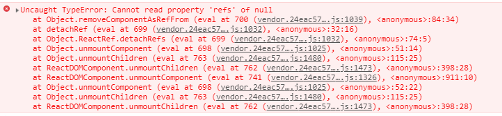

### [react-lifecycle-methods-diagram](https://github.com/wojtekmaj/react-lifecycle-methods-diagram)
  * http://projects.wojtekmaj.pl/react-lifecycle-methods-diagram/


### react 动画库
  * [react-motion](https://github.com/chenglou/react-motion) ⭐️⭐️⭐️⭐️⭐️
    * [react-motion-drawer](https://github.com/stoeffel/react-motion-drawer)
  * [react-spring](https://github.com/react-spring/react-spring)⭐️⭐️⭐️⭐️⭐️

### 数据流
  * [MobX](https://suprise.gitbooks.io/mobx-cn/content/fp.html)
  * [Mobx使用详解](https://www.jianshu.com/p/505d9d9fe36a)


### redux 源码
  * [Redux入坑进阶-源码解析](https://github.com/ecmadao/Coding-Guide/blob/master/Notes/React/Redux/Redux%E5%85%A5%E5%9D%91%E8%BF%9B%E9%98%B6-%E6%BA%90%E7%A0%81%E8%A7%A3%E6%9E%90.md)    [备份](../backup/redux)

    中间中的`next`参数是下一个中间件，最后一个中间件的`next`是`store.dispatch`

    `middlewares=[a,b,c,d,e]` => `applyMiddleware(...middlewares)` => `compose(...middlewares.map(middleware => middleware({getState,dispatch})))(store.dispatch)`
    => `compose(...chain)` => `a(b(c(d(e(store.dispatch)))))`

    

### Redux Style Guide
https://redux.js.org/style-guide/style-guide


### Hooks, React Render props, HOC,  Mixins

 * [[译] 使用 Render props 吧！](https://juejin.im/post/5a3087746fb9a0450c4963a5)
 * [Render Props 官网](https://reactjs.org/docs/render-props.html)
 * [React v16.7 "Hooks" - What to Expect](https://zhuanlan.zhihu.com/p/47684983)


#### A Complete Guide to useEffect ⭐️⭐️⭐️

https://overreacted.io/a-complete-guide-to-useeffect/
https://overreacted.io/zh-hans/a-complete-guide-to-useeffect/


###  深入React fiber 链表和DFS
https://mp.weixin.qq.com/s/Tp05MoV1bQi7rgpYnz1Xhg


### React ref 的前世今生

使用ref时最好使用函数的形式进行负责，字符串的情况有时会出错，并且也影响性能

遇到一个使用string的ref错误，在这里报错, 改成了函数形式就可以了




https://juejin.im/post/5b59287af265da0f601317e3
https://stackoverflow.com/questions/37468913/why-ref-string-is-legacy
https://stackoverflow.com/questions/28519287/what-does-only-a-reactowner-can-have-refs-mean


### ant-design 动态更改From.Item校验规则


Validate 后 Form 会缓存结果，如果你直接动态改 rule 的话，加一个 force 来强制无视缓存就好了

https://codesandbox.io/s/oj9r74k329


https://github.com/ant-design/ant-design/issues/13689


### onClick onChange onKeyUp onKeyDown 事件

`onKeyDown` 获取的 `e.target.value` 总是上一次输入的结果

只有`onKeyDown` `onKeyUp`能获取到 `e.keyCode`

`onChange` 和 `onKeyUp` 都获取到实时输入的 e.target.value`

所以想同时处理 `e.target.value` 和  `e.keyCode` 应该使用 `onKeyUp`

https://codesandbox.io/embed/1j7vj4k27


### React中Redux与通过 connect后获取 ref

1. 可以在`connect`组件加上 `withRef` 参数
```js
@connect(state => ({
  language: state.language,
  smsStatistics: state.billing.smsStatistics,
  mobileStatistics: state.billing.mobileStatistics
}), actionCreators, null, { withRef: true })
```

文档看这里
https://react-redux.js.org/5.x/api/connect-advanced#arguments


获取的时候可以这样
```js
this.halfYear.getWrappedInstance()
```

https://segmentfault.com/a/1190000015172005


2. 可以在包装组件的 `componentDidMount` 方法中调用父组件的方法，把自己的引用主动上报到父组件

connect的组件中componentDidMount方法中
```js
componentDidMount () {
  this.props.saveRef(this)
}
```
父组件中定义好 `saveRef` 接收子组件的引用

```js
saveRef(node) {
  this.childNode = node
}
```

类似的 `rc-form` 中也可以通过类似的方法获取，不过`rc-form`中也有类似1的方式，建议使用官方提供的方法


### React 中有时候 componentWillReceiveProps 中的 nextProps 和 this.props 始终相等

出现这种情况一般是由于传给组件的props一致是同一个对象，使用的是相同的对象的引用地址，导致无法区分前后的props

修改方法就是传给组件的props组件记得要拷贝出一份新的出来即可，

在使用 ant的tabel组件的时候遇到了这个问题，渲染列表数据时想通过 props 来改变组件内部的值，但是 `componentWillReceiveProps`中的前后  `props`值都一样，无法区分

可以看这里，体验一下，https://codesandbox.io/embed/0prjz46r3v

当然一般子组件的props都是绑定在state上，通过`setstate`改变state时，会重新拿到一个新对象，所以不会有问题，出问题的是传给子组件的props是外面传进来的，redux的connect的store中的属性，没处理好的话前后的props是同一个对象的引用，这种错误一般比较难排查，这大概就是 `immutable` 受欢迎的原因吧

https://github.com/camsong/blog/issues/3


### Building a Complex UI Animation in React, Simply
https://css-tricks.com/building-a-complex-ui-animation-in-react-simply/#more-272368


### redux
[深入浅出 - Redux](https://www.w3ctech.com/topic/1561)

[看漫画，学 Redux](https://github.com/jasonslyvia/a-cartoon-intro-to-redux-cn)

[如何理解 Facebook 的 flux 应用架构？](https://www.zhihu.com/question/33864532/answer/57657275)

[Redux 中文文档](https://cn.redux.js.org/)


### setState

总结 :

1. setState 只在合成事件和钩子函数中是“异步”的，在原生事件和 setTimeout 中都是同步的。
2. setState的“异步”并不是说内部由异步代码实现，其实本身执行的过程和代码都是同步的，只是合成事件和钩子函数的调用顺序在更新之前，导致在合成事件和钩子函数中没法立马拿到更新后的值，形式了所谓的“异步”，当然可以通过第二个参数 setState(partialState, callback) 中的callback拿到更新后的结果。
3. setState 的批量更新优化也是建立在“异步”（合成事件、钩子函数）之上的，在原生事件和setTimeout 中不会批量更新，在“异步”中如果对同一个值进行多次 setState ， setState 的批量更新策略会对其进行覆盖，取最后一次的执行，如果是同时 setState 多个不同的值，在更新时会对其进行合并批量更新。


[你真的理解setState吗](https://juejin.im/post/5b45c57c51882519790c7441#heading-5)


https://codesandbox.io/embed/0prjz46r3v


### React性能优化总结
https://segmentfault.com/a/1190000007811296


### 如何解读 react 16.3 引入的新 context api？
https://www.zhihu.com/question/267168180

### react 排错记录
```
Invariant Violation: Objects are not valid as a React child (found: object with keys {}). If you meant to render a collection of children, use an array instead or wrap the object using createFragment(object) from the React add-ons. Check the render method of `XXX`.
```
遇到类似的错误，可能是 xxx 组件中或者子组件中渲染了一个空对象，类似下面的情况, `name = {}` 不注释掉就会报错
```js
  render () {
    const { prefix, displayTitle } = this.props
    let { name, title } = this.state
    name = {}
    return (
      <span
        className={`${prefix}-name-wrapper`}
        title={displayTitle ? title : ''}
      >
        {name}
      </span>
    )
  }
```
打包后的代码可能会报下面的错
```
Unhandled promise rejection Error: Minified exception occurred; use the non-minified dev environment for the full error message and additional helpful warnings.
```
