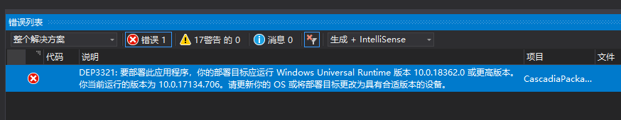
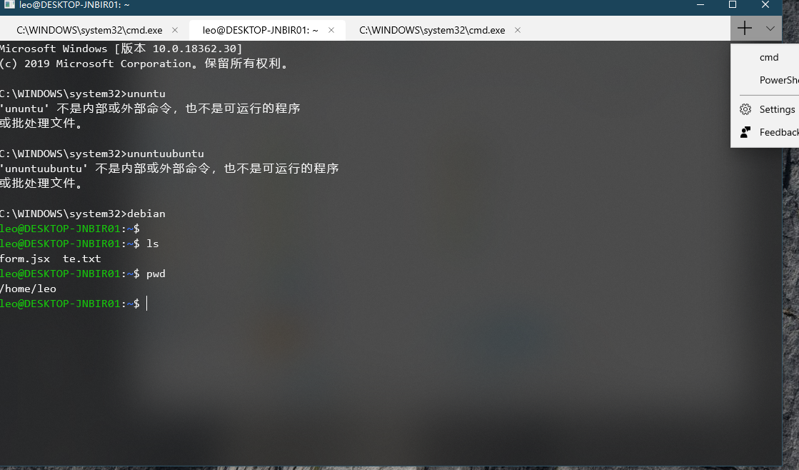
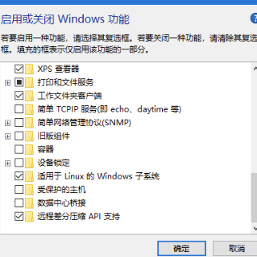

### AI

* [leon 一个开源的个人助手](https://github.com/leon-ai/leon)
  可以部署在服务器, 可以离线使用

### 文本编辑器
  * [smeditor 基于 Vue.js 2.0+ 石墨文档样式的富文本编辑器组件](https://github.com/GeekPark/smeditor)
  * [wangEditor 基于javascript和css开发的 Web富文本编辑器， 轻量、简洁、易用、开源免费](http://www.wangeditor.com/)
  * [Simditor An Easy and Fast WYSIWYG Editor](https://simditor.tower.im/)
  * [vditor 一款浏览器端的 Markdown 编辑器，使用 TypeScript 实现](https://github.com/b3log/vditor)
  * [CodeMirror 基于Javascript，短小精悍，实时在线代码高亮显示，他不是某个富文本编辑器的附属产品，他是许多大名鼎鼎的在线代码编辑器的基础库。](https://github.com/codemirror/CodeMirror)
    [demo](http://www.ibloger.net/assets/apps/tryit/index.html)
  * [Boostnote A markdown editor for developers on Mac, Windows and Linux](https://github.com/BoostIO/Boostnote)

### 图片素材网站
  * [Unsplash 高品质免费高清图片](https://unsplash.com/)
  * [知乎推荐的图片网址](https://www.zhihu.com/question/19619335)

### 团队协同工具
  * [leangoo](https://www.leangoo.com)
  * [trello](https://trello.com/)


### 服务资源
  * [chinese-xinhua 中华新华字典数据库。包括歇后语，成语，词语，汉字](https://github.com/pwxcoo/chinese-xinhua)
  * [知乎无限 live 数据库，仅供学术用途](https://github.com/calpa/zhihu-unlimited-live/blob/master/db.json)
  * [网易云音乐 Node.js API service](https://github.com/Binaryify/NeteaseCloudMusicApi)


### logo制作
  * [logomakr](https://logomakr.com/)
  * [logoaa](https://www.logoaa.com/)
  * [logoaplus](http://www.logoaplus.com)
  * [logaster](https://www.logaster.cn/)
  * [logosc](https://www.logosc.cn/)

### 文档工具
  * [docz](https://github.com/pedronauck/docz)
  * [docsify ](https://github.com/docsifyjs/docsify)
  * [docpress](https://github.com/docpress/docpress)
  * [vuepress](https://github.com/vuejs/vuepress)
  * [react-styleguidist](https://github.com/styleguidist/react-styleguidist)
  * [storybook](https://github.com/storybooks/storybook)
  * [docsify-demo-box-react](https://github.com/njleonzhang/docsify-demo-box-react)
  * [jsdoc-to-markdown](https://github.com/jsdoc2md/jsdoc-to-markdown)
  * [esdoc](https://github.com/esdoc/esdoc)
  * [apidoc](https://github.com/apidoc/apidoc)

### 表情
  * [emoji markup](https://gist.github.com/pq1949/540172a2d4e5db33980f99a9d2c8c5cc)

### 印记中文出品，唯一与官方文档同步的中文文档
  * https://www.docschina.org/


### 排序动画演示
  * https://visualgo.net/en/sorting  ⭐️⭐️⭐️⭐️⭐️


### 在线制作PPT
A framework for easily creating beautiful presentations using HTML

  * https://github.com/hakimel/reveal.js?utm_source=gold_browser_extension#full-setup
  * [Online Editor](https://slides.com/?ref=github)


### 搭建ssh服务器
  * https://github.com/Austin9999/new-pac/wiki/%E8%87%AA%E5%BB%BAss%E6%9C%8D%E5%8A%A1%E5%99%A8%E6%95%99%E7%A8%8B

ssr安装脚本

```bash
wget -N --no-check-certificate https://softs.fun/Bash/ssr.sh && chmod +x ssr.sh && bash ssr.sh
```

ssr备用脚本
```bash
wget -N --no-check-certificate https://raw.githubusercontent.com/ToyoDAdoubi/doubi/master/ssr.sh && chmod +x ssr.sh && bash ssr.sh
```

谷歌BBR加速脚本
```bash
wget --no-check-certificate https://github.com/teddysun/across/raw/master/bbr.sh && chmod +x bbr.sh && bash bbr.sh
```

### 运行流畅的客服系统 ⭐️⭐️⭐️⭐️⭐️
动画
  * https://www.intercom.com/
  * https://small.chat/


### Code Review 工具

  `phacility`  https://phacility.com  [预览](https://secure.phabricator.com/D20083)
  `gerrit` https://www.gerritcodereview.com/

### terminal for Windows⭐️⭐️⭐️⭐️⭐️

[MobaXterm](https://mobaxterm.mobatek.net/)


### yarn network error

```
info There appears to be trouble with your network connection. Retrying...
```
```bash
yarn config set proxy http://127.0.0.1:1080
yarn config set https-proxy http://127.0.0.1:1080
```

https://github.com/yarnpkg/yarn/issues/4890


### create-react-app 使用docz报错

`package.json`文件中加入

```json
"resolutions": {
  "ansi-styles": "^3.2.0"
}
```
删除lock文件重新install
```
rm yarn.lock && yarn
```

关于 `resolutions` 可以看[这里](https://yarnpkg.com/lang/zh-hans/docs/selective-version-resolutions/)，yarn专门用来解决指定安装特定版本包的字段

npm中没有对应的字段，不过可以用 `npm-force-resolutions`这个来解决 略显麻烦 所以还是用yarn吧

https://github.com/pedronauck/docz/issues/536

https://stackoverflow.com/questions/52416312/npm-equivalent-of-yarn-resolutions


### nginx 配置自签名证书

创建私钥
```
openssl genrsa -out server.key 1024
```
创建证书签名请求 (Common Name要填成对应网站的IP或者域名,其他的可忽略)
```
openssl req -new -key server.key -out server.csr
```

创建自签名证书 (可以添加  `-days 3650` 指定10年有效期 )
```
openssl x509 -req -in server.csr -signkey server.key -out server.crt
```
配置nginx

```
 server {
    listen 8082 ssl;
    ssl_certificate /home/leo/nginx/conf/server.crt;
    ssl_certificate_key /home/leo/nginx/conf/server.key;
    location / {
       alias /home/leo/webim/;
     }
   }

```

https://ningyu1.github.io/site/post/51-ssl-cert/

http://blog.harrisonxi.com/2017/02/%E7%BB%99nginx%E5%88%9B%E5%BB%BA%E4%B8%AA%E8%87%AA%E7%AD%BE%E5%90%8DSSL%E8%AF%81%E4%B9%A6.html


### CentOS 7 更新nginx

切换到root用户，新建如下文件
```
vi /etc/yum.repos.d/nginx.repo
```

贴入如下内容
```
[nginx]
name=nginx repo
baseurl=http://nginx.org/packages/centos/$releasever/$basearch/
gpgcheck=0
enabled=1
```

开始更新
```
yum update nginx
```

之前有启动过nginx，需要先停止在更新
```
sudo service nginx stop
```

```
sudo service nginx start
```

https://codybonney.com/install-the-latest-version-of-nginx-on-centos-6-and-centos-7-using-yum/


### nginx 403 Forbidden
可能是文件访问权限的问题
nginx version: nginx/1.14.2
默认配置文件中是用nginx这个用户启动的，所以会没有权限
```
root     21877     1  0 17:42 ?        00:00:00 nginx: master process nginx
nginx    25148 21877  0 17:54 ?        00:00:00 nginx: worker process

```
把配置文件的用户改成静态资源所属的用户即可

https://www.jianshu.com/p/e0dadb871894


### git alias 配置

```
git config --list | grep alias
alias.lg=log --color --graph --pretty=format:'%Cred%h%Creset -%C(yellow)%d%Creset %s %Cgreen(%cr) %C(bold blue)<%an>%Creset' --abbrev-commit
alias.st=status
alias.ci=commit
alias.co=checkout
alias.br=branch


git config --global alias.lg "log --color --graph --pretty=format:'%Cred%h%Creset -%C(yellow)%d%Creset %s %Cgreen(%cr) %C(bold blue)<%an>%Creset' --abbrev-commit"
git config --global alias.co checkout
git config --global alias.ci commit
git config --global alias.br branch
git config --global alias.st status


or edit  .gitconfig

[credential]
        helper = manager
[difftool "sourcetree"]
        cmd = 'd:/Program Files/Beyond Compare 4/BComp.exe' \"$LOCAL\" \"$REMOTE\"
[mergetool "sourcetree"]
        cmd = 'd:/Program Files/Beyond Compare 4/BComp.exe' \"$LOCAL\" \"$REMOTE\" \"$BASE\" \"$MERGED\"
        trustExitCode = true
[core]
        autocrlf = false
        safecrlf = true
[alias]
        lg = log --color --graph --pretty=format:'%Cred%h%Creset -%C(yellow)%d%Creset %s %Cgreen(%cr) %C(bold blue)<%an>%Creset' --abbrev-commit
        st = status
        ci = commit
        co = checkout
        br = branch
```


### 找技术库的网站 ⭐️⭐️⭐️

www.awesomes.cn/


### webpac在线配置 ⭐️⭐️⭐️

https://createapp.dev/


### css裁剪路径 ⭐️⭐️⭐️

https://bennettfeely.com/clippy/


### 正则表达式

http://refiddle.com/


### Package Diff

https://diff.intrinsic.com/?pkg=&min=&max=


### 获取本机ip地址

```js
function getIPAdress(){
    var interfaces = require('os').networkInterfaces();
    for(var devName in interfaces){
          var iface = interfaces[devName];
          for(var i=0;i<iface.length;i++){
               var alias = iface[i];
               if(alias.family === 'IPv4' && alias.address !== '127.0.0.1' && !alias.internal){
                     return alias.address;
               }
          }
    }
}
```


### git教程

https://learngitbranching.js.org/


### 不错的教程

https://nodeschool.io/zh-cn/


### git bash 新增命令别名

打开`gitbash` 直接`cd`进入个人根目录
```bash
cd
notepad .bashrc
```
输入下面内容到 `.bashrc` 文件
notepad++的安装目录中如果有特殊字符，可以用 `\` 进行转义
```
alias o="/d/Program\" \"Files\" \"\(x86\)/Notepad++/notepad++.exe"
```


### windows Terminal 安装

1. `git clone git@github.com:microsoft/Terminal.git`
2. `git submodule update --init --recursive`
3. `.\nuget restore OpenConsole.sln` ( `nuget` 可以在`\dep\nuget`中找到)
4. 安装 `visual studio 2017`  https://docs.microsoft.com/en-us/visualstudio/releasenotes/vs2017-relnotes 2019也安装过，错误比较多就换了
5. 用`visual studio 2017` 打开 `OpenConsole.sln` 生产解决方案，不出意外，会有些错误，按照提示去网上搜解决办法，
    其中一个改了比较久的是pch内存不够，这个需要改一下windows的默认的虚拟内存，同时 visual studio 中对应设置成\zm200 获取其他可以
6. 需要设置成 release 和 x64 进行构建
7. 最后好不容易编译好了，又会提示windows版本不够要升级，那就升级一下吧，注册账号，更新到windows预览版
   
8. 然后在部署就可以成功了
   

装完后可以在win10商店中安装一下wsl玩玩

ubuntu或者debian，安装之前需要 进入应用，选择程序和功能，点击启用或关闭Windows功能，勾选适用于Linux的Windows子系统


`ubuntu`和`debian`的目录在`windows`中是在这个问题

```
C:\Users\Administrator\AppData\Local\Packages\CanonicalGroupLimited.UbuntuonWindows_79rhkp1fndgsc\LocalState\rootfs

C:\Users\Administrator\AppData\Local\Packages\TheDebianProject.DebianGNULinux_76v4gfsz19hv4\LocalState\rootfs\home\leo
```

有意思的是在windows中直接复制或者新建文件在wsl中是看不到这个文件的，但是wsl新建同名文件保存又会提示失败。

通过在wsl的shell中 输入 `explore.exe .` 打开对应的网络位置后，可以进行两个系统的文件共享

`\\wsl$` 这个就是安装的系统共享的目录

https://github.com/microsoft/Terminal/issues/489#issue-441161390


### windows 批量重命名

`ren *.txt *.sql`
https://blog.csdn.net/zhouzihan520xj/article/details/40301087


### 除了追番，你还可以在 B 站爱上学习
https://sspai.com/post/54624


### dva与umi笔记
https://yewills.github.io/2019/05/19/dva_umi/

### 网页模板
http://www.ym4j.com/


### js 调用栈演示
http://latentflip.com/loupe/


### 评论
- [Valine ](https://valine.js.org/)
- [GITALK](https://gitalk.github.io/)


### Canvas + WebSocket + Redis 实现一个视频弹幕
https://segmentfault.com/a/1190000016654011


### 简述 OAuth 2.0 的运作流程
https://www.barretlee.com/blog/2016/01/10/oauth2-introduce/


### node 爬虫全栈
https://github.com/yhlben/cdfang-spider

### Kiwi-国际化全流程解决方案
https://github.com/alibaba/kiwi


### 一个基于 React 的可缩放图片控件
https://github.com/Caldis/react-zmage

###  下载视频
https://www.urlgot.com/

https://www.clipconverter.cc/

https://mac.eltima.com/cn/youtube-downloader-mac.html


1. 下载视频
https://www.urlgot.com/

2. 自动识别字幕
https://www.8bage.com/

3. 字幕格式转换(ass->srt)
http://www.nicetool.net/app/subtitle_convert.html


### centOS 安装 Gitlab Runner

https://mirror.tuna.tsinghua.edu.cn/help/gitlab-runner/

1. 新建 `/etc/yum.repos.d/gitlab-runner.repo`

```
[gitlab-runner]
name=gitlab-runner
baseurl=https://mirrors.tuna.tsinghua.edu.cn/gitlab-runner/yum/el7
repo_gpgcheck=0
gpgcheck=0
enabled=1
gpgkey=https://packages.gitlab.com/gpg.key
```
2. 执行
```
sudo yum makecache
sudo yum install gitlab-runner
```
3. 启动
```
sudo gitlab-runner start
```

### 徽章地址 Badges

https://shields.io/
https://badgen.net/
https://forthebadge.com/
https://badge.fury.io/
https://github.com/boennemann/badges

### 使用Astah Community建UML类图之总结
https://www.cnblogs.com/wuhuisheng/archive/2012/09/12/2682263.html
### restful-api-design-references
https://github.com/aisuhua/restful-api-design-references

### 正则表达式
1. [learn-regex](https://github.com/ziishaned/learn-regex/blob/master/translations/README-cn.md)


### chrome 插件开发

1. [Chrome 插件开发官方文档 What are extensions?](https://developer.chrome.com/extensions)
2. [Chrome扩展及应用开发（首发版）](http://www.ituring.com.cn/book/miniarticle/110853)
3. [360极速浏览器翻译的官方文档](http://open.chrome.360.cn/extension_dev/overview.html)

### 静态页面

1. http://8.101.com/  动画流畅
