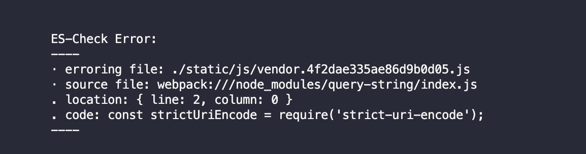
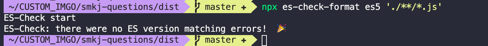

### 自动生成webpack配置

https://createapp.dev

http://webpack.jakoblind.no


### webpack 教程

英文  https://webpack.js.org/concepts/

中文 https://www.webpackjs.com/concepts/


### Time-saving synchronised browser testing.
https://browsersync.io/
http://www.browsersync.cn/


### webpack sourcemap
https://blog.csdn.net/liwusen/article/details/79414508
https://segmentfault.com/a/1190000016404266


### Critical dependencies webpack WARNING
This seems to be a pre-built javascript file. Though this is possible, it's not recommended. Try to require the original source to get better results.

linux
```
 module: {
        noParse: /node_modules\/localforage\/dist\/localforage.js/,
        loaders: [...],
```

windows
```
/[\/\\]node_modules[\/\\]localforage[\/\\]dist[\/\\]localforage\.js$/
```

https://github.com/localForage/localForage/issues/577


### webpack babel 打包后的不兼容问题处理

1. safari 打开页面白屏，连上手机到电脑上查看，控制台报错如下

```
SyntaxError: Cannot declare a let variable twice
```

2. 按照这个错误搜索得到的答案是改一下 uglifyjs-webpack-plugin 的配置，此配置是为了兼容 safari 10 本身的bug
https://bugs.webkit.org/show_bug.cgi?id=171041
https://github.com/webpack-contrib/uglifyjs-webpack-plugin/issues/92#issuecomment-324818437

```js
(a) => {let a;}
```

3. 按照上面办法修改后，safari确实不报错，可以正常打开页面了，但是问题好像并没有根本解决，为什么打包后的代码还是有 `let` es6的语法

4. 继续搜索打包后的代码，果然代码中还有 `const`, `let` 等es6的语法，继续核对项目的 `browserslist` 配置，确认配置无误后继续搜索

```json
"browserslist": [
    "> 1%",
    "last 2 versions",
    "not ie <= 8"
  ]
```

5. 继续搜索打包后的代码，发现const，附件是`vuex`的代码，那是 `vuex`代码没打成es6吗？

6. 修改 webpack的js loader的babel配置，include中添加了 `node_modules/vuex`

```js
 {
    test: /\.js$/,
    loader: 'babel-loader',
    include: [resolve('src'), resolve('test'), resolve('node_modules/vuex'),resolve('node_modules/webpack-dev-server/client')]
}
```

7.继续搜索 build后的代码，还是存在const和let,问题应该不在这，进一步确认 `node_modules/vuex`中的代码，确实已经转译到es5的语法了，那究竟是哪个 `node_modules` 中的包没转译了

8. 继续搜索，发现下面这篇文章，有个工具可以用来检测打包后的代码哪个包没转译，真是太棒了！
https://zhuanlan.zhihu.com/p/116729213

https://www.npmjs.com/package/es-check#why-es-check

https://www.npmjs.com/package/es-check-format

执行 `npx es-check-format es5 './dist/**/*.js'`, 终于定位到问题在哪里了



去 `node_modules`中查看 `query-string` 果然这个包没打成es5，去github查看，作者这样回复

https://github.com/sindresorhus/query-string/issues/239#issuecomment-583494423

使用 `query-string@5` 以前的版本即可，所以这里安装后，再次检测，顺利通过了，继续搜索build的代码，也没有const和let了！




8. 修改后，真机验证也顺利通过！
